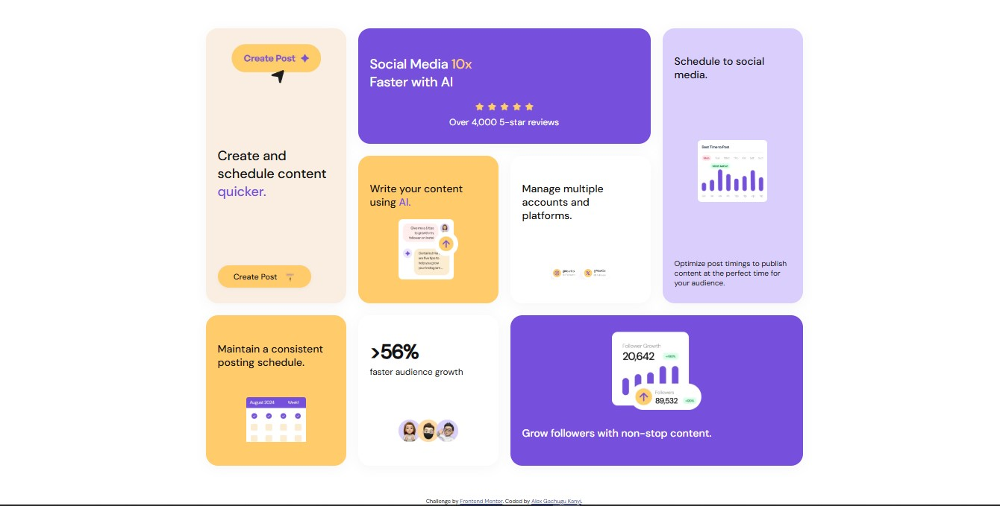

# Frontend Mentor - Bento grid solution

This is a solution to the [Bento grid challenge on Frontend Mentor](https://www.frontendmentor.io/challenges/bento-grid-RMydElrlOj). Frontend Mentor challenges help you improve your coding skills by building realistic projects.

## Table of contents

- [Overview](#overview)
  - [The challenge](#the-challenge)
  - [Screenshot](#screenshot)
  - [Links](#links)
- [My process](#my-process)
  - [Built with](#built-with)
  - [What I learned](#what-i-learned)
  - [Continued development](#continued-development)
  - [Useful resources](#useful-resources)
- [Author](#author)
- [Acknowledgments](#acknowledgments)

## Overview

### The challenge

Users should be able to:

- View the optimal layout for the interface depending on their device's screen size

### Screenshot



### Links

- Solution URL: [https://github.com/Alxtexh/bento-grid](https://github.com/Alxtexh/bento-grid)
- Live Site URL: [https://alxtexh.github.io/bento-grid/](https://alxtexh.github.io/bento-grid/)

## My process

### Built with

- Semantic HTML5 markup
- CSS custom properties
- CSS Grid
- Flexbox
- Mobile-first workflow

### What I learned

During this project, I improved my skills in CSS Grid and responsive design. I learned how to structure a bento grid layout using modern CSS and how to use custom properties for consistent theming. I also practiced using `@font-face` to load local fonts and ensured accessibility and responsiveness across devices.

```css
.bento-grid {
  display: grid;
  grid-template-columns: repeat(4, 1fr);
  gap: 24px;
}
```

### Continued development

I plan to continue improving my CSS Grid skills and explore more advanced responsive techniques. I also want to experiment with adding subtle animations and transitions to enhance user experience.

### Useful resources

- [CSS Grid Guide (MDN)](https://developer.mozilla.org/en-US/docs/Web/CSS/CSS_Grid_Layout)
- [Frontend Mentor Community](https://www.frontendmentor.io/community)
- [The Markdown Guide](https://www.markdownguide.org/)

## Author

- Website - [Alex Gachugu Kanyi](https://www.alx.a21cash.com)
- Frontend Mentor - [@Alxtexh]
- Twitter - [@alxtexh]

## Acknowledgments

Thanks to the Frontend Mentor community for feedback and support!
